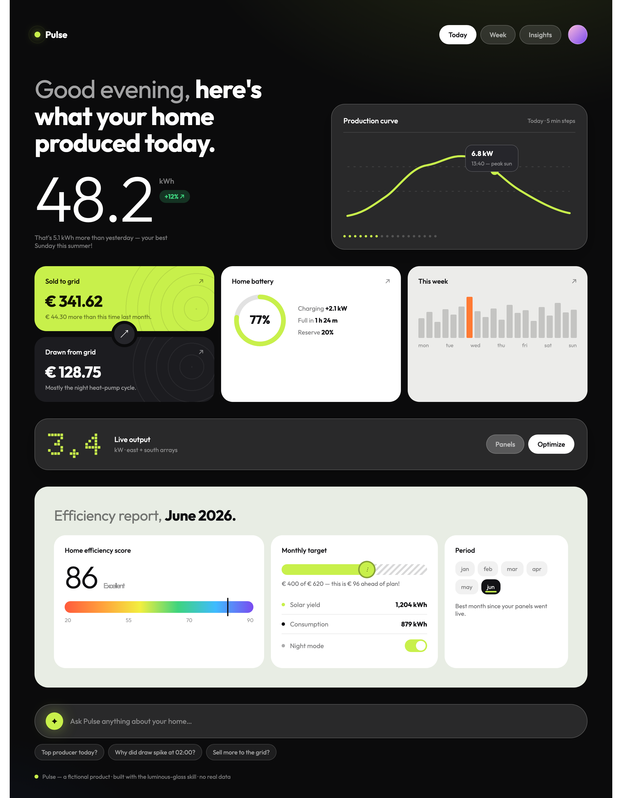

<div align="center">

# luminous‑glass

### A codified **“atmospheric glass”** design genre — packaged as a Claude Code skill.

Dark / light dual‑mode surfaces&nbsp;·&nbsp;frosted glass over photography&nbsp;·&nbsp;one luminous accent per project<br/>giant hero numerals&nbsp;·&nbsp;dot‑matrix data textures&nbsp;·&nbsp;editorial device presentation

<br />

[](https://github.com/1mp3ctz/luminous-glass/releases)
[](./LICENSE)
[](https://docs.claude.com/en/docs/claude-code)
[](#whats-inside)

</div>

<br />

```sh
/plugin marketplace add 1mp3ctz/luminous-glass
/plugin install luminous-glass@luminous-glass
```

<div align="center"><sub>Then invoke <code>/luminous-glass</code> — or just ask for “luminous glass” while building any UI.</sub></div>

<br />

---

## ✦ See it in action

Every pixel below was produced by the skill from `tokens.css` alone — **“Pulse,”** a fictional solar dashboard, no real data. It’s the calibration example that ships in `examples/demo.html`.

<div align="center">

</div>

<br />

---

## ✦ The 12 Laws

The genre in one screen. The skill enforces these; break them and it stops being luminous‑glass.

| # | Law | In one line |
|:--:|---|---|
| 1 | **Two poles, one accent** | A noir pole *and* a sage/cream light pole — plus exactly **one** saturated accent, constant across both. |
| 2 | **Accent follows domain** | Lime = default · thermal orange = security/energy · magenta = personal · acid‑yellow×black = enterprise · blue/teal = infra. |
| 3 | **Color is glow, not wallpaper** | Neutrals stay achromatic; color arrives as radial glow and luminous accents. Rare pixels, high power. |
| 4 | **The number is the protagonist** | One giant stat per view — thin for measures, bold for money — with a small conversational caption. |
| 5 | **Two‑tone headlines** | Dim setup + bold payoff. The payoff word carries the weight. |
| 6 | **UI floats as glass** | Photography or gradient *is* the background; panels are blur + faint white tint + hairline borders. |
| 7 | **Bento mixes surfaces** | Accent + white + gray + black cards in one grid; color‑fields carry engraved / halftone texture. |
| 8 | **Dot‑matrix is the data voice** | LED bar‑forests, dot‑tick rulers, pixel numerals for the display moments. |
| 9 | **Charts are expressive but precise** | Squiggle + tooltip, glowing‑orb pies, radial gauges — never the default‑library look. |
| 10 | **Backgrounds are never dead** | Noir gets a glow; light gets sage/latte warmth; announcements go full‑bleed gradient. |
| 11 | **Presentation is editorial** | Devices on raw‑material props, giant type behind screens — the marketing shot is part of the system. |
| 12 | **Soul: data made human** | Dense, technical domains rendered emotional. Atmosphere over sterility, calm over clutter. |

<br />

---

## ✦ What's inside

| Path | Purpose |
|---|---|
| `skills/luminous-glass/SKILL.md` | The 12 Laws, anti‑patterns, routing table, working method |
| `skills/luminous-glass/references/tokens.css` | **The source of truth** — every value as a CSS variable |
| `skills/luminous-glass/references/components-web.md` | Copy‑ready HTML/CSS component recipes |
| `skills/luminous-glass/references/design-language.md` | The full codified genre |
| `skills/luminous-glass/references/swiftui-adapter.md` | Native macOS / iOS translation |
| `skills/luminous-glass/references/art-direction.md` | Hero images, App Store shots, OG images |
| `skills/luminous-glass/references/moodboard.md` | 12 calibration anchors + squint‑test protocol |
| `skills/luminous-glass/examples/demo.html` | The self‑contained “Pulse” example above |
| `skills/luminous-glass/study/corpus.md` | The abstracted evidence base behind the laws |

<br />

---

## ✦ Working method

1. **Pick the domain accent** (Law 2) and declare it in one line before designing.
2. **Build only from `tokens.css`** — never invent ad‑hoc values; extend the tokens if something is genuinely missing.
3. **Build the hero moment first** — the giant number and the two‑tone headline — then support it.
4. For each screen ask: *where is the atmosphere?* and *what single element is luminous?*
5. **Squint‑test** against the demo and 2–3 moodboard anchors: same family?

<br />

---

## ✦ Genre codification, not cloning

luminous‑glass teaches you to produce **new** work in an aesthetic family. It ships no third‑party assets, brand marks, or copied screens, and its study corpus is an abstracted set of design observations — palette statistics, typographic rules, and composition laws — never a specific source.

<br />

<div align="center">

**MIT** © Viktor — built with, and for, [Claude Code](https://docs.claude.com/en/docs/claude-code).

<sub>accent‑first · build from tokens · one luminous thing per screen</sub>

</div>
